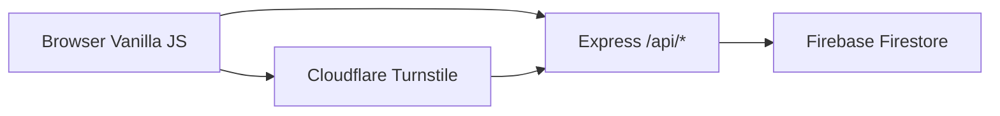

# 🗳 Voices Voting App — Deployment Guide
sdsdassasaaa
## Architecture Overview
asdasdasssasdasss

sdadsa
## 1. Local Development
1. **Environment**: Copy `.env.example` to `.env`.
   - Ensure `FIREBASE_PROJECT_ID`, `FIREBASE_CLIENT_EMAIL`, and `FIREBASE_PRIVATE_KEY` are set.sasad
   - Use the testing keys for Turnstile (already in `.env`).
2. **Install**: Run `npm install`.
3. **Run**: Run `npm run dev`.
4. **Access**: Open [http://localhost:3001](http://localhost:3001).

## 2. Project Features
- **Anonymous Voting**: Upvote or downvote statements.
- **Dynamic Ranking**: Sorted by total votes (up - down).
- **Anti-Spam**: Cloudflare Turnstile integration + IP-based rate limiting.
- **Admin Portal**: Hidden gear icon in bottom-right.
  - Default Key: `admin123` (set in `.env`).
  - Allows adding and deleting statements.

## 3. Deployment (Vercel)
The project is configured for Vercel out of the box.

1. Install Vercel CLI: `npm i -g vercel`.
2. Run `vercel` in the project root.
3. Add Environment Variables in Vercel Dashboard:
   - `FIREBASE_PROJECT_ID`
   - `FIREBASE_CLIENT_EMAIL`
   - `FIREBASE_PRIVATE_KEY`
   - `ADMIN_KEY`
   - `TURNSTILE_SECRET_KEY`

## 4. Key Files
- `index.html`: The entire frontend (UI + Logic).
- `api/index.js`: The backend processing logic.
- `api/server.js`: Local server wrapper.
- `.env`: Secret keys (do not commit to Git).
